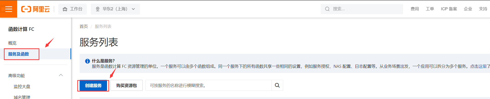
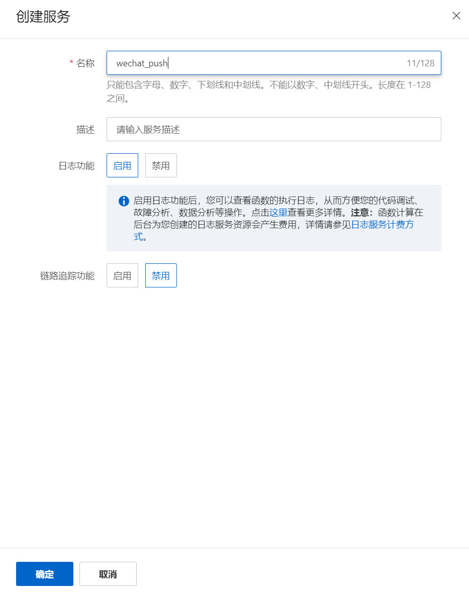
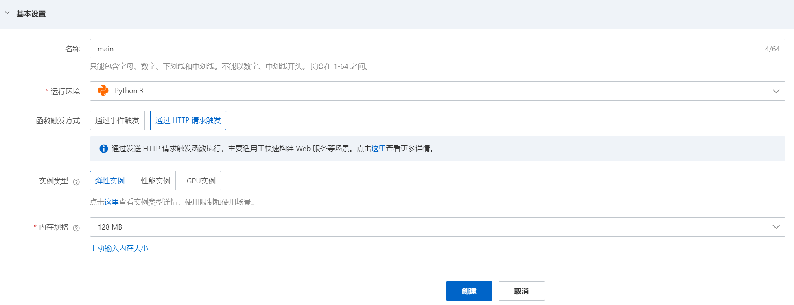
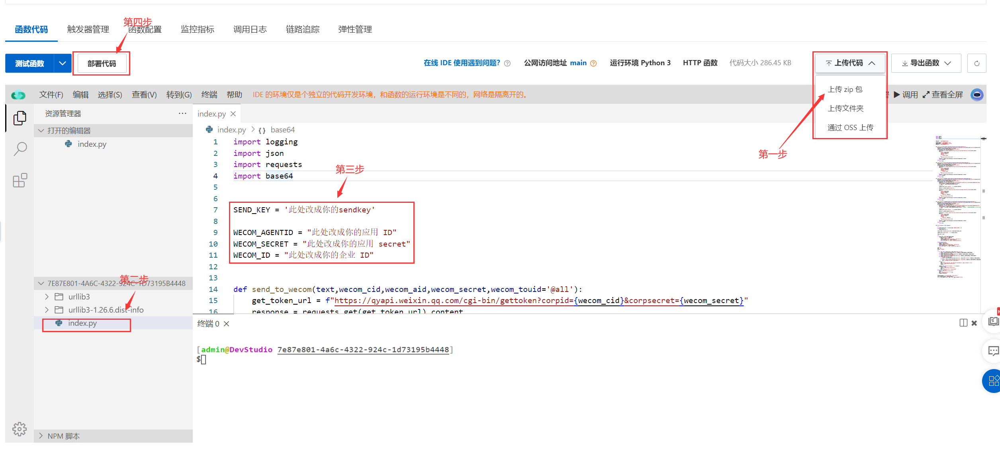

## 阿里云函数部署 Wecom 酱

部署步骤:

1. 按照[首页](https://github.com/easychen/wecomchan)的说明配置企业微信, 准备好以下信息.
   1. 企业 ID
   2. 应用 secret
   3. 应用 ID
   4. 你自己设置的密码 (sendkey)

2. 打开[阿里云函数计算](https://fcnext.console.aliyun.com/overview), 创建服务.

   

3. 服务名称自选, 点击确定.

   

4. 创建函数, 函数名称自选, 运行环境 Python3, 内存规格 128MB, 其余保持默认.

   

5. 选择`上传代码 - 上传 zip 包`, 上传[这个文件](main-code.zip), 使用网页代码编辑器修改 `index.py` 中的变量为第一步获取的变量, 完成后点击`部署代码`.

6. 完成!

#### 使用方法

将以下内容以 json 格式 POST 到函数的公网访问地址即可.

| 字段 | 说明                                              | 是否必须        |
| ---- | ------------------------------------------------- | --------------- |
| key  | 设置的 sendkey                                    | 是              |
| type | text, image, markdown 或 file 其中之一            | 否, 默认为 text |
| msg  | 消息主体(需要推送的文本或图片/文件的 Base64 编码) | 是              |

例:

```
{"key":"123", "msg": "Hello, World!"}
```

```
{"key":"123", "type": "markdown", "msg": "**Markdown Here!**"}
```

