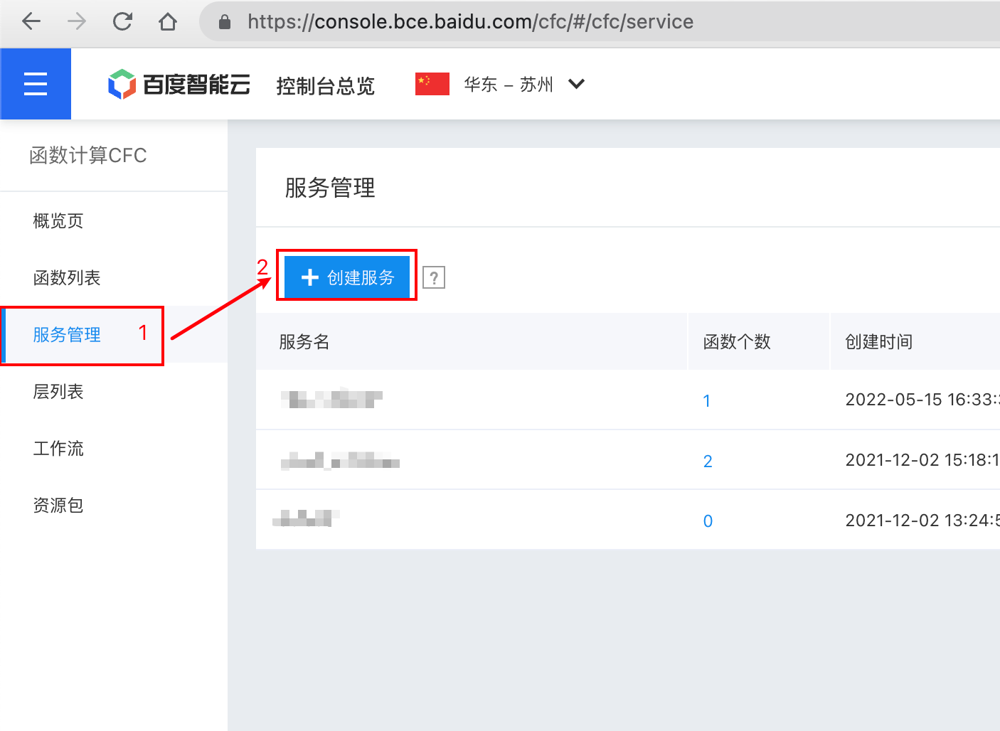
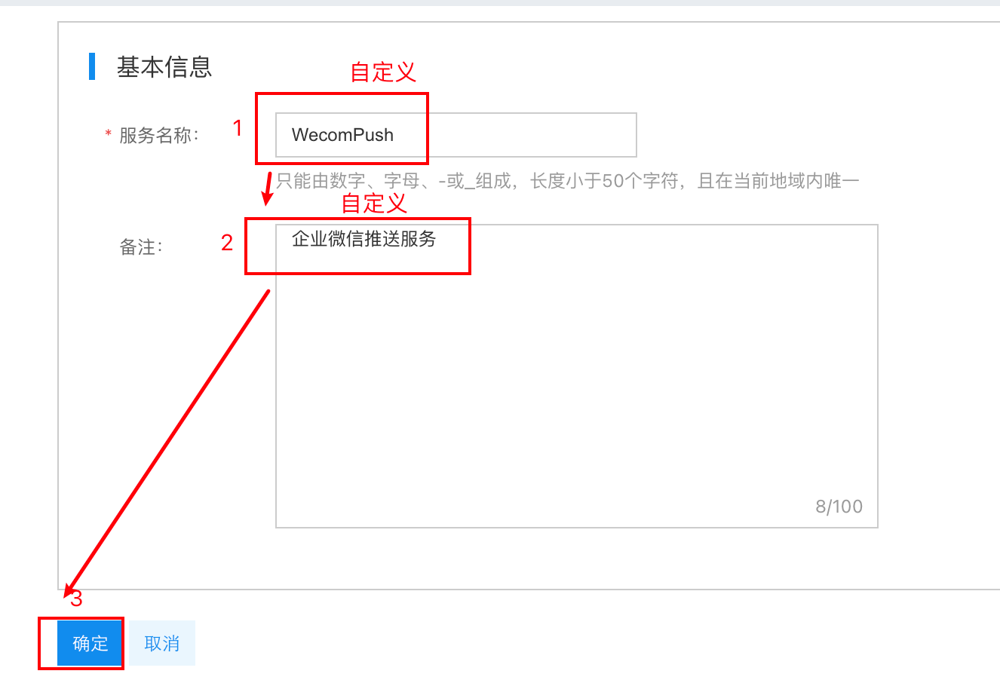
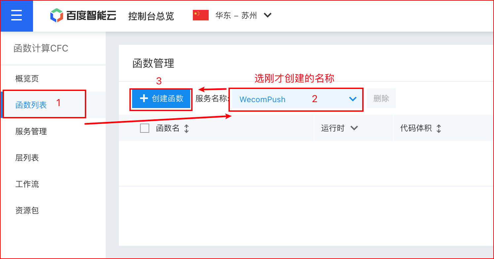
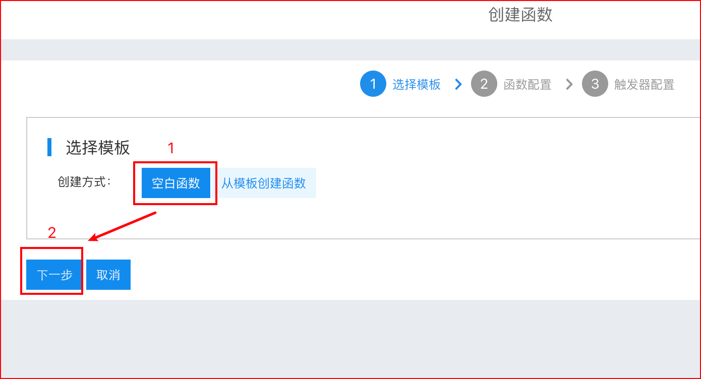
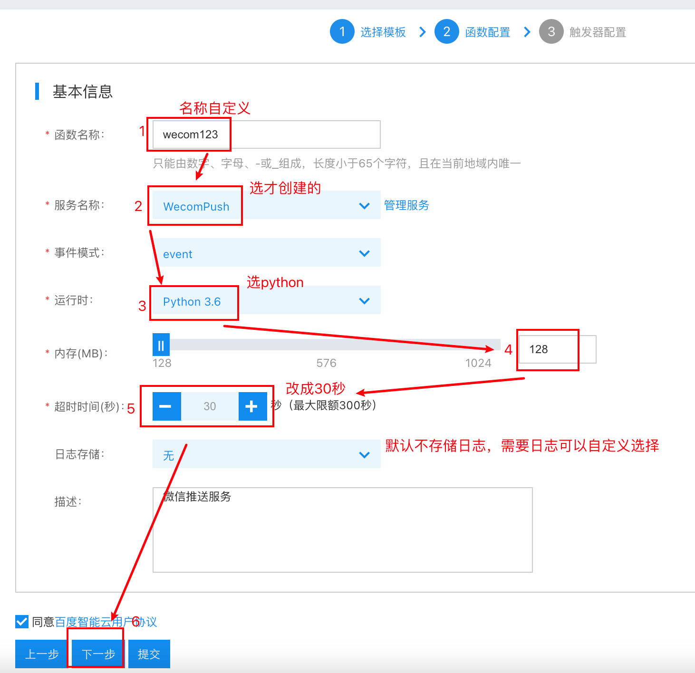
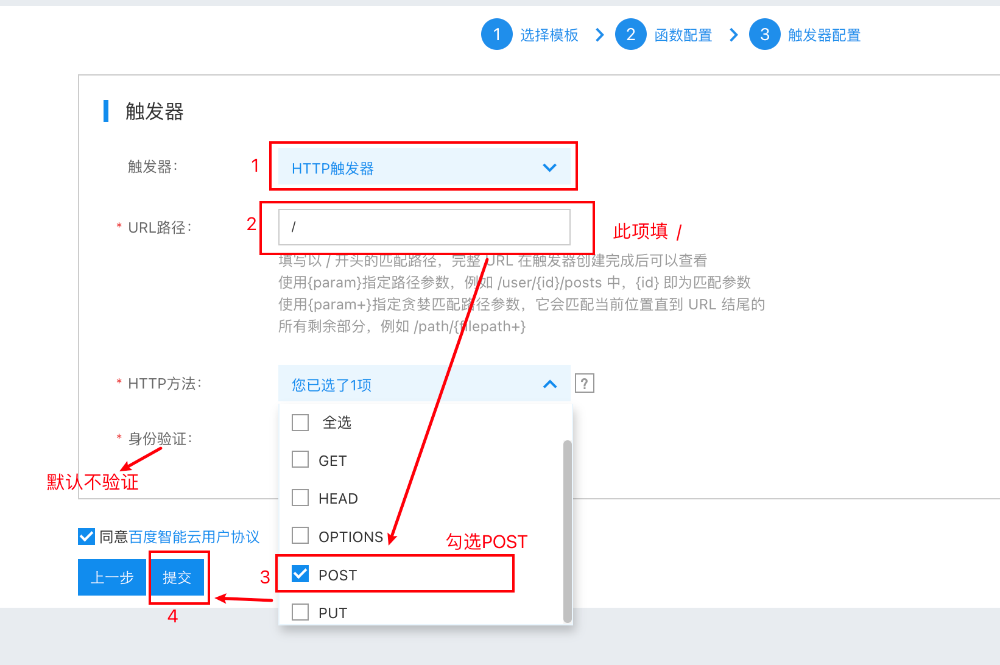
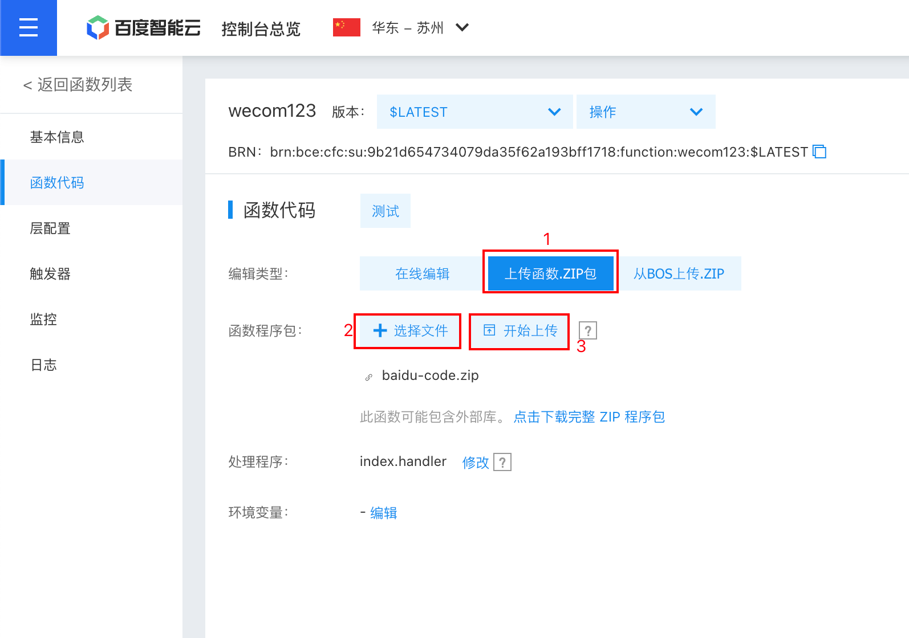
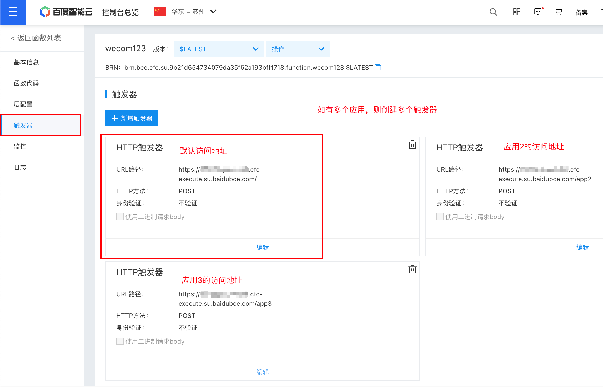

## 百度智能云·函数计算CFC 部署 Wecom 酱

部署步骤:

1. 按照[首页](https://github.com/easychen/wecomchan)的说明配置企业微信, 准备好以下信息.
   1. 企业 ID
   2. 应用 secret
   3. 应用 ID
   4. 你自己设置的密码 (sendkey)

2. 打开[百度智能云·函数计算CFC](https://console.bce.baidu.com/cfc/), 创建服务.（若没有账户请自行创建）

   

3. 服务名称自选, 点击确定.

   

4. 创建函数, 函数名称自选, 运行环境 Python3.6, 内存规格 128MB, 其余如图所示或默认.

   

   

   

   

5. 进入`代码编辑页`，选择`上传函数.ZIP包`, 上传[这个文件](baidu-code.zip), 上传成功后，使用`在线编辑`修改 `index.py` 中的几个变量为第一步获取的变量, 完成后点击`保存`.

   需要修改的有第 `7，128，129，130`这四行。

   
   
   如果需要配置多个应用，可把132-142行的注释去掉，并修改为对应的变量。如果只有一个应用则忽略。
   

6. 完成!

#### 使用方法

将以下内容以 json 格式 POST 到函数的公网访问地址即可.

| 字段 | 说明                                              | 是否必须        |
| ---- | ------------------------------------------------- | --------------- |
| key  | 设置的 sendkey                                    | 是              |
| type | text, image, markdown 或 file 其中之一            | 否, 默认为 text |
| msg  | 消息主体(需要推送的文本或图片/文件的 Base64 编码) | 是              |
| uid  | 发送消息的用户id，格式为 `zhangsan\|lisi\|wangwu` | 否，默认为 `@all` |

例:

```
{"key":"123", "msg": "Hello, World!"}
```

```
{"key":"123", "msg": "Hello, World!", "uid": "zhangsan"}
```

```
{"key":"123", "type": "markdown", "msg": "**Markdown Here!**"}
```

```
{
    "key": "123",
    "type": "text",
    "msg": "文本中支持<a href=\"https://www.baidu.com\">超链接</a>"
}
```